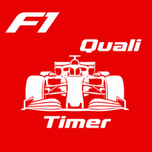
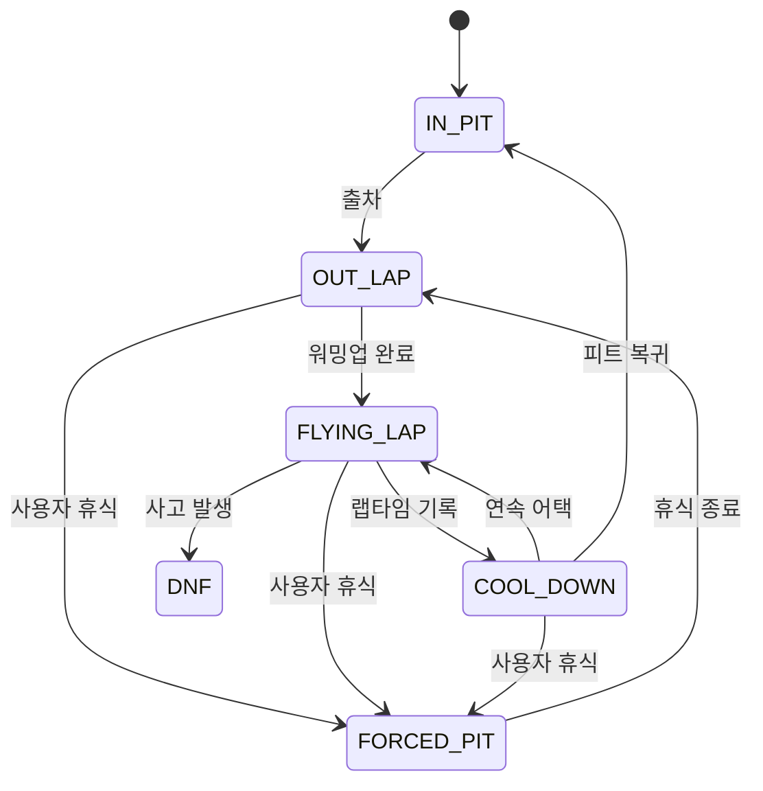

# F1 Qualifying Study Timer

<p align="center">
  
</p>

<p align="center">
  <strong>공부 시간을 F1 퀄리파잉 세션으로 바꾸는 몰입형 타이머</strong><br />
  집중하는 동안 22명의 드라이버가 트랙에서 랩타임을 경쟁합니다.
</p>

<p align="center">
  
  
  
  
</p>

## 프로젝트 소개

F1 Qualifying Study Timer는 공부 세션을 Formula-style 퀄리파잉으로 시각화한 웹 앱입니다. 드라이버와 서킷, 목표 시간을 고르면 공부 타이머와 22대의 퀄리파잉 시뮬레이션이 함께 시작됩니다.

사용자는 공부 중 PIT STOP을 선택해 휴식을 기록할 수 있고, 목표 시간이 끝나면 진행 중인 랩을 Fast Forward로 정산한 뒤 최종 그리드와 세션 결과를 확인할 수 있습니다.

> 현재 프로젝트는 Alpha 단계입니다. 시뮬레이션 밸런스와 PWA 동작은 계속 조정되고 있습니다.

## 주요 기능

- 2026 시즌 기준 22명 드라이버 선택
- 22개 서킷과 서킷별 기준 랩타임
- OUT LAP, FLYING LAP, COOL DOWN, PIT 상태 시뮬레이션
- 실시간 드라이버 위치, 랩타임, P1 대비 갭과 순위 표시
- 세션 진행에 따른 트랙 개선과 랩타임 변화
- 트래픽, 옐로·레드 플래그, DNF 이벤트
- 5분, 10분, 15분 PIT STOP 휴식
- 목표 시간 종료 후 Fast Forward 및 최종 결과 제공
- 정적 내보내기와 PWA 지원

## 사용 흐름

```text
드라이버 선택 → 서킷 선택 → 공부 시간 설정 → 퀄리파잉 세션 → 최종 결과
```

1. 함께 달릴 드라이버를 선택합니다.
2. 공부 세션의 무대가 될 서킷을 선택합니다.
3. 목표 공부 시간을 설정합니다.
4. 실시간 랭킹과 서킷 상황을 보며 공부합니다.
5. 세션 종료 후 최고 랩, 순위, 공부 기록을 확인합니다.

## 엔진 핵심 원리

레이스 엔진은 UI와 분리된 상태 갱신 함수로 구성됩니다. 애니메이션 프레임마다 경과 시간을 전달하면 엔진이 레이서 상태, 트랙 진행도, 랩타임, 이벤트와 세션 단계를 갱신합니다.

```text
현재 SessionState + deltaMs → tickEngine() → 새로운 SessionState
```

각 드라이버는 다음 상태 머신을 독립적으로 순환합니다.



랩타임은 서킷 기준 기록에 드라이버 페이스, 랩별 편차, 세션 진행도, 트래픽과 플래그 페널티를 합성해 계산합니다.

```text
lapTime = trackBaseTime × paceFactor
        + lapVariation
        + sessionProgressPenalty
        + trafficPenalty
        + flagPenalty
```

트랙 위 위치는 `0~1` 범위의 진행도를 SVG path 길이에 대응시켜 계산합니다. 공부 목표 시간이 끝나면 세션은 Fast Forward로 전환되고, 모든 차량이 주행을 마치면 최고 랩타임 순으로 최종 그리드를 확정합니다.

상태 전이, 랩타임 공식, 트래픽, 플래그, PIT와 Fast Forward의 상세 규칙은 [엔진 설계 문서](docs/engine.md)를 참고하세요.

## 기술 스택

| 영역 | 기술 |
| --- | --- |
| Framework | Next.js 15 App Router |
| Language | TypeScript |
| UI | React 19, Tailwind CSS 4 |
| State | Zustand 5 |
| Animation | Framer Motion |
| Track rendering | SVG Path API |
| Distribution | Static Export, PWA |

## 로컬 실행

### 요구 사항

- Node.js 20 이상 권장
- npm

### 설치 및 개발 서버

```bash
git clone https://github.com/fotrhh22/f1-qualifying-study-timer.git
cd f1-qualifying-study-timer
npm install
npm run dev
```

브라우저에서 [http://localhost:3000](http://localhost:3000)을 엽니다.

### 프로덕션 빌드

```bash
npm run build
```

정적 결과물은 `out/` 디렉터리에 생성됩니다. PWA 서비스 워커는 개발 환경에서는 비활성화되고 프로덕션 빌드에서 생성됩니다.

## 프로젝트 구조

```text
src/
├── app/          # 화면과 App Router 경로
├── components/   # Setup, Session, Results UI
├── data/         # 드라이버, 서킷, 코너 데이터
├── engine/       # 상태 머신과 시뮬레이션 로직
└── store/        # Setup 및 Session 상태 관리

docs/
└── engine.md     # 레이스 엔진 상세 설계
```

## 로드맵

- [x] 드라이버·서킷·시간 설정 흐름
- [x] 실시간 퀄리파잉 시뮬레이션
- [x] 랩타임 랭킹과 SVG 트랙 렌더링
- [x] PIT STOP과 Fast Forward
- [x] 최종 결과 화면
- [ ] 22개 서킷 전수 시각 검증
- [ ] 시뮬레이션 밸런스 조정
- [ ] 엔진 단위 테스트 및 재현 가능한 random seed
- [ ] PWA 설치·오프라인 동작 검증
- [ ] 접근성과 성능 개선

## 데이터와 크레딧

- Circuit layouts: [julesr0y/f1-circuits-svg](https://github.com/julesr0y/f1-circuits-svg), [CC BY 4.0](https://creativecommons.org/licenses/by/4.0/)
- 서킷 기준 랩타임은 퀄리파잉 폴 기록을 바탕으로 구성했습니다.

이 프로젝트는 비공식 팬 프로젝트이며 Formula 1, FIA, Formula One Group 또는 각 팀과 제휴하거나 공식 승인을 받은 프로젝트가 아닙니다. Formula 1 관련 명칭, 로고와 상표의 권리는 각 권리자에게 있습니다.
