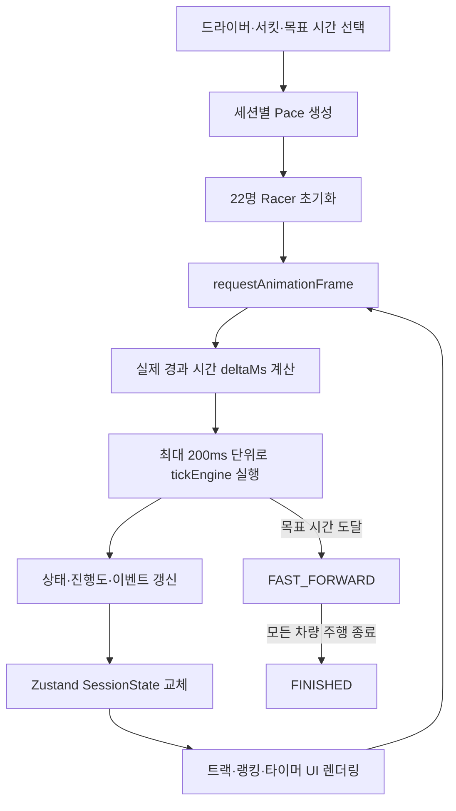
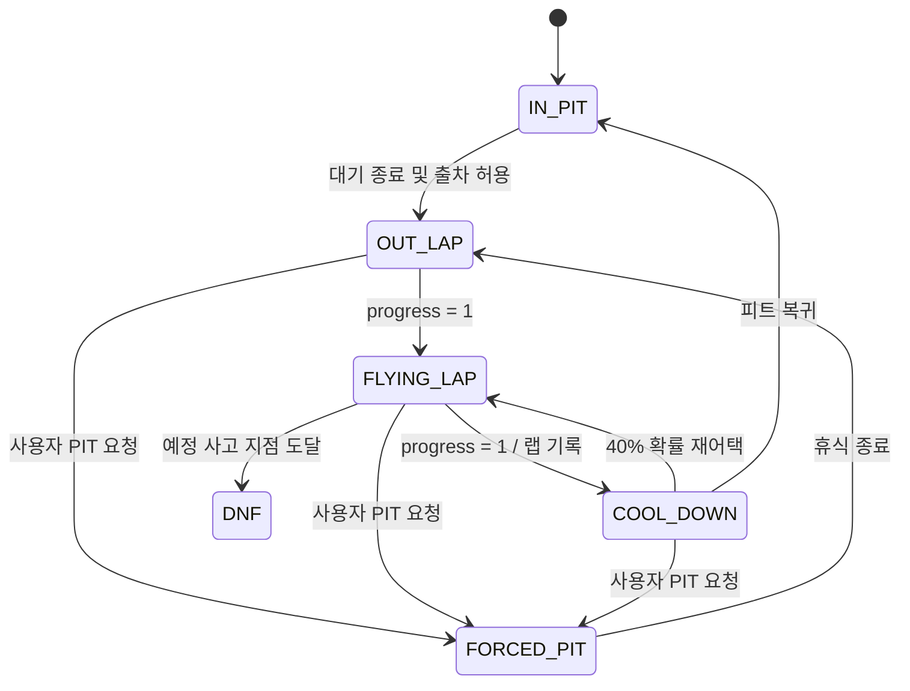
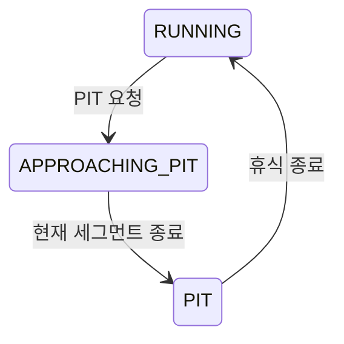

# Race Engine

이 문서는 F1 Qualifying Study Timer의 시뮬레이션 엔진이 세션과 22명의 드라이버를 갱신하는 방식을 설명합니다. 실제 동작의 기준은 `src/engine/`과 `src/store/sessionStore.ts`입니다.

## 설계 목표

엔진은 다음 원칙을 따릅니다.

- React 컴포넌트와 레이스 규칙을 분리합니다.
- 모든 런타임 정보를 하나의 `SessionState`로 표현합니다.
- 프레임 간 경과 시간인 `deltaMs`를 기준으로 시뮬레이션을 진행합니다.
- 드라이버마다 독립적인 상태와 랩 기록을 유지합니다.
- 공부 시간과 퀄리파잉 세션의 진행을 하나의 시간축으로 연결합니다.

핵심 갱신 형태는 다음과 같습니다.

```ts
tickEngine(state: SessionState, deltaMs: number): SessionState
```

엔진은 React와 DOM에 의존하지 않지만 현재 `Date.now()`와 `Math.random()`을 내부에서 사용합니다. 따라서 reducer와 유사하게 동작하지만 같은 입력이 항상 같은 출력을 만드는 완전한 결정론적 순수 함수는 아닙니다.

## 전체 실행 흐름



Zustand store는 `requestAnimationFrame`으로 실제 경과 시간을 측정합니다. 탭이 잠시 비활성화되는 등 큰 시간 차이가 발생해도 엔진은 최대 200ms 크기의 step으로 나누어 처리합니다. 한 번의 catch-up은 최대 30분으로 제한해 과도한 반복과 UI 정지를 방지합니다.

## 데이터 모델

### SessionState

`SessionState`는 세션 전체의 단일 진실 공급원입니다.

| 필드 | 역할 |
| --- | --- |
| `phase` | 현재 세션 단계 |
| `trackId` | 선택한 서킷 |
| `userId` | 사용자가 선택한 드라이버 |
| `studyTargetMs` | 목표 세션 시간 |
| `studyElapsedMs` | 현재까지 흐른 세션 시간 |
| `userStatus` | 사용자의 주행·휴식 상태 |
| `racers` | 22명의 런타임 상태 |
| `fastForwardMultiplier` | 종료 정산 배속 |
| `accumulatedPitMs` | 사용자가 PIT에서 보낸 누적 시간 |
| `currentFlag` | 현재 트랙 플래그 |

세션 단계는 다음 순서로 진행됩니다.

```text
IDLE → RUNNING → FAST_FORWARD → FINISHED
```

- `RUNNING`: 공부 타이머와 레이스를 실시간으로 진행합니다.
- `FAST_FORWARD`: 목표 시간 종료 후 트랙에 남은 차량의 랩을 배속 정산합니다.
- `FINISHED`: 모든 주행을 끝내고 최종 결과를 고정합니다.

### Racer

각 `Racer`는 기본 정보 외에 다음 런타임 데이터를 가집니다.

- 세션별 `pace`
- 현재 `status`
- 트랙 위 `progress`
- 현재 상태에 진입한 시간과 예상 지속 시간
- 최고 랩, 직전 랩과 전체 랩 기록
- 앞차·뒤차 간격과 트랙 위 위치
- 트래픽 페널티와 DNF 예정 지점

## 드라이버 상태 머신



| 상태 | 설명 | 속도 배율 |
| --- | --- | ---: |
| `IN_PIT` | 출차 전 대기 | `0` |
| `OUT_LAP` | 타이어를 준비하는 워밍업 랩 | `0.90` |
| `FLYING_LAP` | 기록을 측정하는 어택 랩 | `1.05` |
| `COOL_DOWN` | 어택 이후 회복 랩 | `0.85` |
| `FORCED_PIT` | 사용자가 선택한 휴식 | `0` |
| `DNF` | 더 이상 진행하지 않는 리타이어 | `0` |

AI 드라이버는 네 개의 출차 wave에 무작위로 배치됩니다. 각 wave의 기본 출차 시점과 3초 간격, ±1초 jitter를 조합해 초반 밀집을 줄입니다. 사용자는 세션 시작 후 약 1~2분 사이에 출차합니다.

## Pace 모델

정적 드라이버 데이터에는 팀 경쟁력과 개인 기량을 반영한 `basePace`가 있습니다. 세션 시작 시 각 드라이버의 실제 pace를 한 번 생성합니다.

```text
pace = clamp(basePace + random(-2.5, 2.5), 88, 99)
```

부동소수점 값을 유지하기 때문에 동일한 `basePace`를 가진 드라이버도 미세하게 다른 성능을 가집니다. 높은 pace가 평균적으로 유리하지만 결과를 고정하지는 않습니다.

## 진행도와 상태 지속 시간

트랙 위 진행도는 `0~1` 범위입니다.

```text
progressDelta = effectiveDelta / stateDuration
nextProgress = min(1, progress + progressDelta)
```

`effectiveDelta`는 일반 세션에서는 실제 `deltaMs`이고, Fast Forward에서는 다음과 같습니다.

```text
effectiveDelta = deltaMs × fastForwardMultiplier
```

상태별 1랩 지속 시간은 서킷 기준 시간과 pace, 속도 배율로 계산합니다.

```text
paceAdjustment = 1 - (pace - 90) × 0.002
stateDuration = trackBaseTime × paceAdjustment / speedMultiplier
```

OUT LAP에는 `0.7~1.3`, COOL DOWN에는 `0.85~1.15` 범위의 추가 변동을 적용해 모든 비측정 랩이 같은 시간에 끝나지 않도록 합니다.

## 랩타임 모델

FLYING LAP을 완주하면 다음 요소를 합성해 기록을 생성합니다.

```text
lapTime = max(
  trackBaseTime × 0.99,
  trackBaseTime × paceFactor
    + lapVariation
    + sessionProgressPenalty
) + yellowFlagPenalty + trafficPenalty
```

### 드라이버 페이스

```text
paceFactor = 1.05 - (pace - 90) × 0.005
```

| Pace | Pace factor |
| ---: | ---: |
| 90 | `1.050` |
| 95 | `1.025` |
| 99 | `1.005` |

### 랩별 편차

```text
lapVariation = random(-1.2%, 1.2%) × trackBaseTime
```

동일한 드라이버도 매 랩 다른 기록을 내도록 하는 요소입니다.

### 세션 진행에 따른 트랙 개선

```text
sessionProgress = clamp(studyElapsedMs / studyTargetMs, 0, 1)
sessionProgressPenalty = trackBaseTime × 0.05 × (1 - sessionProgress)
```

세션 초반에는 기준 시간의 최대 5%가 추가되고, 목표 시간에 가까워질수록 0으로 수렴합니다. 이를 통해 세션 후반에 기록이 개선되는 퀄리파잉의 흐름을 표현합니다.

### 기록 저장

완료한 모든 FLYING LAP은 `lapTimes`에 저장합니다.

```text
lastLap = 새로 완주한 랩
bestLap = min(lapTimes)
```

OUT LAP과 COOL DOWN은 전체 주행 수에는 반영되지만 측정 랩 수인 `lapCount`에는 포함하지 않습니다.

## 트래픽 모델

트랙 위 차량을 `progress` 순서로 정렬하고 순환 트랙을 고려해 앞차와 뒤차의 간격을 계산합니다.

```text
gapAhead  = 앞차까지의 progress 차이
gapBehind = 뒤차부터의 progress 차이
```

다음 조건을 모두 만족하면 트래픽 페널티가 누적됩니다.

- 현재 차량이 `FLYING_LAP` 상태입니다.
- 앞차가 `OUT_LAP` 또는 `COOL_DOWN` 상태입니다.
- 앞차와의 progress 차이가 `0.03` 미만입니다.

```text
trafficPenalty += effectiveSeconds × 300ms
```

페널티는 해당 FLYING LAP 완료 시 랩타임에 반영되고 다음 랩을 시작할 때 초기화됩니다.

트랙 위 차량 수에 따라 AI의 출차 확률도 달라집니다.

| 트랙 위 차량 | Tick당 출차 확률 |
| ---: | ---: |
| 5대 이하 | 20% |
| 6~14대 | 10% |
| 15대 이상 | 5% |

이 값은 피트 대기 시간이 끝난 AI에게만 적용됩니다.

## DNF와 플래그

AI가 OUT LAP을 끝내고 FLYING LAP에 진입할 때 사고 여부를 결정합니다.

- FLYING LAP 진입당 DNF 확률: `0.5%`
- 세션당 AI DNF 최대 수: `2`
- DNF 지점: 트랙 진행도 `0.15~0.85`

예정 지점에 도달하면 차량은 해당 위치에서 `DNF`가 됩니다. Fast Forward 중에는 새 플래그를 발생시키지 않습니다.

일반 세션에서 새 DNF가 발생하면 플래그를 추첨합니다.

| 결과 | 확률 범위 | 동작 |
| --- | ---: | --- |
| Red flag | 12% | 트랙 위 차량을 피트로 이동하고 60초간 유지 |
| Yellow flag | 33% | 45초간 유지 |
| No flag | 55% | 세션을 그대로 진행 |

옐로 플래그 중 FLYING LAP을 완주하면 `1~3초`의 추가 페널티가 붙습니다.

## PIT STOP

사용자는 5분, 10분 또는 15분 휴식을 선택할 수 있습니다.



트랙 위에서 PIT을 요청하면 차량을 즉시 순간이동시키지 않습니다. 현재 상태의 남은 진행 시간을 계산해 피트 입구까지 주행한 뒤 `FORCED_PIT`으로 전환합니다. 이미 피트에 있다면 즉시 휴식을 시작합니다.

현재 구현에서 PIT 중에도 전체 세션 시계인 `studyElapsedMs`는 계속 증가합니다. 대신 PIT 체류 시간은 `accumulatedPitMs`에 별도로 누적됩니다.

```text
netStudyTime = studyElapsedMs - accumulatedPitMs
```

휴식이 끝나면 사용자 차량은 `OUT_LAP`으로 복귀합니다. AI 드라이버와 전체 세션은 사용자 PIT 중에도 계속 진행됩니다.

## Fast Forward와 종료

`studyElapsedMs`가 `studyTargetMs`에 도달하면 세션은 `FAST_FORWARD`로 전환됩니다.

1. 현재 피트에 있는 차량의 남은 대기 시간을 배속에 맞게 압축합니다.
2. 트랙 위 차량은 설정된 배율로 남은 상태를 진행합니다.
3. 이미 유효한 기록을 남기고 피트에 복귀한 차량은 새 랩을 시작하지 않습니다.
4. 모든 차량이 `IN_PIT`, `FORCED_PIT` 또는 `DNF`가 되면 `FINISHED`로 전환합니다.

사용자가 DNF를 선택하면 공부 세션도 즉시 Fast Forward로 전환합니다. UI의 Skip 동작은 진행 중인 FLYING LAP을 기록으로 정산하고 나머지 차량을 피트로 이동시킨 뒤 바로 결과를 확정합니다.

## 랭킹

랭킹은 드라이버의 최고 FLYING LAP을 기준으로 오름차순 정렬합니다.

1. `bestLap`이 있는 차량을 빠른 순서대로 배치합니다.
2. 기록이 없는 차량을 뒤에 배치합니다.
3. 둘 다 기록이 없다면 DNF 차량을 비-DNF 차량보다 뒤에 배치합니다.
4. P1의 최고 기록과 각 차량의 최고 기록 차이로 gap을 계산합니다.

```text
gap = driver.bestLap - p1.bestLap
```

DNF 차량도 사고 전에 유효한 랩을 기록했다면 해당 기록으로 순위에 포함됩니다.

## SVG 트랙 좌표 변환

엔진은 차량 위치를 서킷과 무관한 `progress`로 저장합니다. UI는 브라우저 SVG Path API로 이를 실제 좌표로 변환합니다.

```text
pathLength = path.getTotalLength()
point = path.getPointAtLength(progress × pathLength)
```

트랙별 `pathOffset`과 `pathOffsetReversed`로 실제 스타트 라인과 주행 방향을 보정하고, `rotationAngle`은 화면 표시 방향을 조정합니다. 생성한 `SVGPathElement`는 트랙 ID별로 캐시해 프레임마다 다시 만들지 않습니다.

## 코드 위치

| 파일 | 책임 |
| --- | --- |
| `src/engine/types.ts` | 세션, 레이서, 트랙 타입 |
| `src/engine/pace.ts` | 세션별 드라이버 pace 생성 |
| `src/engine/lapTime.ts` | 랩타임 계산과 표시 형식 |
| `src/engine/raceEngine.ts` | 상태 전이, tick, 순위, PIT, DNF |
| `src/engine/svgPath.ts` | progress를 SVG 좌표로 변환 |
| `src/store/sessionStore.ts` | 엔진 초기화와 animation frame loop |

## 향후 개선

- 시간 공급자와 난수 생성기를 주입해 완전한 결정론적 실행 지원
- seed를 저장해 동일 세션 재현
- 상태 전이와 랩타임 모델 단위 테스트
- 확률과 페널티 값을 별도 밸런스 설정으로 분리
- background tab과 긴 suspend 이후의 시간 처리 정책 세분화
- 시뮬레이션 이벤트 로그를 엔진 출력으로 통합

결정론적 구조로 개선하면 다음 형태의 테스트가 가능해집니다.

```ts
tickEngine(state, deltaMs, {
  now: fixedTimestamp,
  random: seededRandom,
})
```

이를 통해 동일한 seed와 tick 입력으로 같은 퀄리파잉 결과를 재현하고 밸런스 변경 전후를 비교할 수 있습니다.
